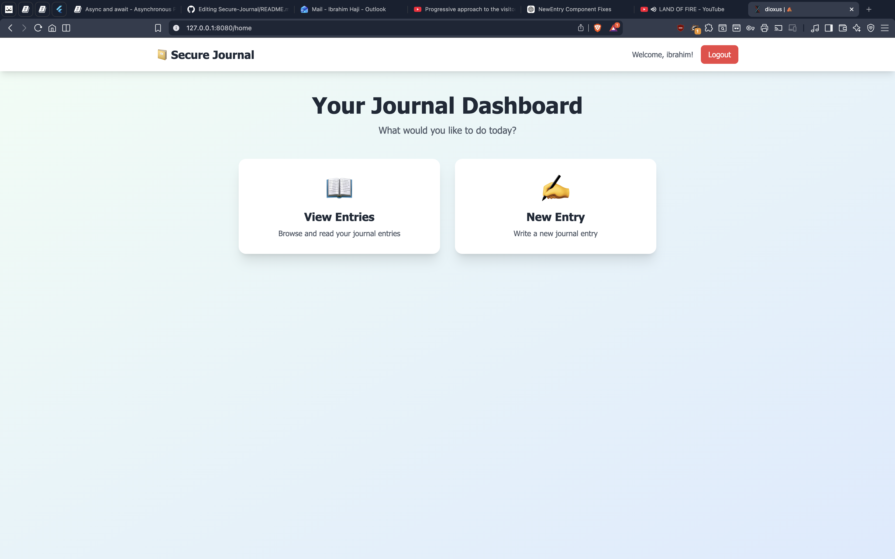
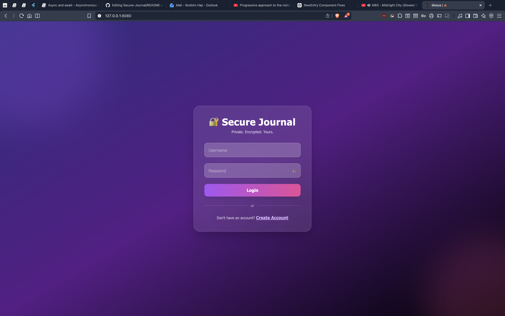
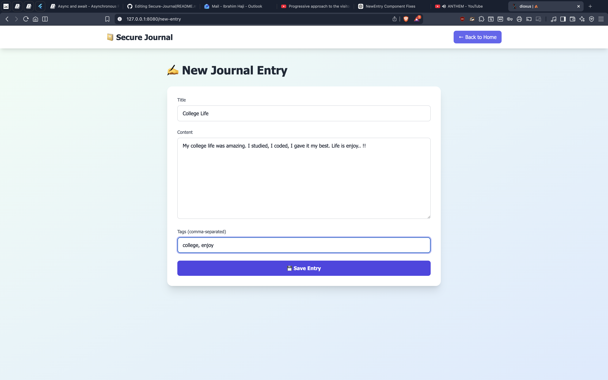
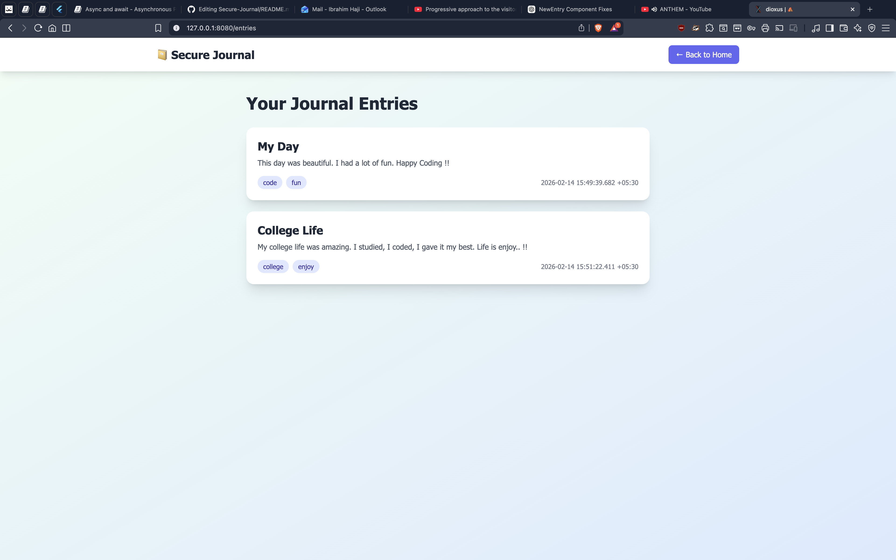

# 🛡️ Secure Journal App

> *Your thoughts deserve the same protection as your passwords.*
> A beautifully minimal, end-to-end secure journal built with Rust — where privacy, performance, and design meet.

---

## 📸 Preview

<div align="center">

### 🎯 Main Interface


*Clean code structure with async main function and modular design*

### 📝 Journal Operations


*Create accounts, write entries, and manage your journal with ease*

### ✨ Full Workflow



*From account creation to entry management - see the full experience*

</div>

---

## ✨ Overview

**Secure Journal App** is a private journaling tool built in Rust that keeps your notes safe and encrypted.
Every entry is protected with **Argon2 password hashing** and **rpassword-based encryption**, ensuring that your data stays truly yours — even offline.

This isn't just a journal — it's a **fortress for your thoughts**.

---

## 🔐 Features

* 🧠 **Encrypted Entries** — Uses [`rpassword`](https://crates.io/crates/rpassword) to handle passwords securely without exposing them in terminal input.
* 🧩 **Strong Password Hashing** — Implements [`argon2`](https://crates.io/crates/argon2) to hash and verify master passwords.
* ⚡ **Async & Fast** — Powered by [`tokio`](https://crates.io/crates/tokio) for asynchronous, non-blocking operations.
* 🎨 **Colorized CLI Experience** — Beautiful terminal output with [`colorized`](https://crates.io/crates/colorized) for clear and intuitive interaction.
* 🌐 **Modern Web Interface** — Built with [`Dioxus`](https://dioxuslabs.com) for a reactive, performant frontend experience.
* 🚀 **RESTful API Backend** — Powered by [`Axum`](https://docs.rs/axum) for fast, ergonomic HTTP services.
* 💾 **Next-Gen Database** — Uses [`SurrealDB`](https://surrealdb.com) for flexible and secure data storage.
* 🧰 **Robust Error Handling** — Managed with [`anyhow`](https://crates.io/crates/anyhow) for clear, user-friendly error messages.
* 📦 **Serialization Made Simple** — Data structures powered by [`serde`](https://crates.io/crates/serde) for seamless serialization and deserialization.

---

## ⚙️ Tech Stack

| Layer             | Technology             | Purpose                                    |
| :---------------- | :--------------------- | :----------------------------------------- |
| 🖥️ Frontend       | **Dioxus**             | Reactive web interface with Rust           |
| 🌐 Backend API    | **Axum**               | High-performance async HTTP server         |
| 🗄️ Database       | **SQLite**             | Secure, flexible data persistence          |
| 🔒 Encryption     | **rpassword + argon2** | Protects journal access and data integrity |
| ⚙️ Runtime        | **Tokio**              | Async operations & performance             |
| 🧰 Error Handling | **anyhow**             | Simplified and consistent error reporting  |
| 🧱 Serialization  | **Serde**              | Efficient and safe data handling           |
| 🎨 CLI UI         | **Colorized**          | Clean and vivid command-line experience    |

---

## 🚀 Getting Started

### 1️⃣ Prerequisites

Make sure you have **Rust** (latest stable) installed.

```bash
rustup update
```

### 2️⃣ Clone the Repository

```bash
git clone https://github.com/yourusername/secure-journal.git
cd secure-journal
```

### 3️⃣ Build & Run

#### CLI Version
```bash
cd backend
cargo build --release
cargo run
```

#### Web Interface (Dioxus + Axum)
```bash
# Terminal 1 - Start the backend API
cd backend
cargo run

# Terminal 2 - Start the frontend
cd frontend
dx serve --platform web/desktop/android
```

The web interface will be available at `http://localhost:8080`

### 4️⃣ Create Your Master Password

The app will prompt you to set a secure password.
Your password is hashed with **Argon2**, and entries are encrypted using **rpassword** mechanisms.

---

## 🧱 Project Structure

```
secure-journal/
│
├── backend/
│   ├── Cargo.toml
│   └── src/
│       ├── main.rs
├       ├── router.rs
│       ├── db.rs
│       ├── tests/
│       ├── auth/
│       │     ├── api 
│       │     │     ├── login_api.rs
│       │     │     ├── mod.rs
│       │     │     ├── signup_api.rs
│       │     ├── http 
│       │     │     ├── login_handler.rs
│       │     │     ├── mod.rs
│       │     │     ├── signup_handler.rs
├       ├     ├     ├── types.rs
│       │     │
│       │     ├── delete.rs
│       │     ├── entries.rs
│       │     ├── login.rs
│       │     ├── mod.rs
│       │     ├── signup.rs
│       │     └── validate.rs
│       ├── common/
│       │   ├── error.rs
│       │   ├── mod.rs
│       │   └── utils.rs
│       ├── helpers/
│       │   ├── export.rs
│       │   ├── import.rs
│       │   └── mod.rs
│       └── models/
│           ├── mod.rs
│           └── models.rs
│
├── frontend/
│   ├── Cargo.toml
│   ├── Dioxus.toml
│   ├── tailwind.css
│   ├── public /
│   │   ├── main.css
│   │   └── tailwind.css
│   └── src/
│       ├── components/
│       │     ├── mod.rs
│       │     ├── navbar.rs
│       ├── pages/
│       │     ├── entries.rs
│       │     ├── home.rs
│       │     ├── login.rs
│       │     ├── mod.rs
│       │     ├── new_entry.rs
│       │     ├── signup.rs
│       ├── api.rs
│       ├── models.rs
│       ├── models.rs
│       ├── models.rs
│       ├── models.rs
│       ├── state.rs
│       └── main.rs
│
├── Cargo.toml
└── README.md
```

---

## 🛠️ Building from Source

### Quick Builds
```bash
# Build for current platform
cargo build --release

# Build all platforms
chmod +x build-scripts/build-all.sh
./build-scripts/build-all.sh

# Create release packages
chmod +x build-scripts/package-releases.sh
./build-scripts/package-releases.sh 0.1.0

# Build Debian package
chmod +x build-scripts/build-deb.sh
./build-scripts/build-deb.sh 0.1.0
```

### Platform-Specific

**Windows:**
```powershell
.\build-scripts\build-windows.ps1
```

**Linux:**
```bash
chmod +x build-scripts/build-linux.sh
./build-scripts/build-linux.sh
```

## 📦 Release Artifacts

After building, you'll find these in `target/releases/v{VERSION}/`:
- `secure-journal-windows-x64-v{VERSION}.zip`
- `secure-journal-linux-x64-v{VERSION}.tar.gz`
- `secure-journal-linux-x64-v{VERSION}.tar.xz`
- `secure-journal-linux-arm64-v{VERSION}.tar.gz`
- `backend_{VERSION}_amd64.deb`

---

## 🎯 Usage

### CLI Interface

```bash
# Create an account
cargo run
> Create account

# Login
> Login
username: yourusername
password: ********

# Write entries
> Write a new journal entry
title: My First Entry
content: Today was amazing...

# View entries
> View my journal entries

# Delete entries
> Delete a journal entry

# Logout
> Logout
```

### Web Interface

Access the modern web UI at `http://localhost:8080` with:
- User authentication
- Rich text editor for entries
- Beautiful, responsive design
- Real-time updates

---

## 🔮 Future Plans

* [x] Integrating Axum for RESTful API
* [x] Adding Dioxus for modern web interface
* [x] Export to multiple formats (PDF, JSON, etc.)
* [ ] Encrypted cloud sync option
* [ ] Mobile app support
* [ ] Markdown support in entries
* [ ] Entry search and filtering

---

## ❤️ Built With Rust

> *Fast. Safe. Fearless.*

---

## 🛠️ License

This project is licensed under the **MIT License** — see the [LICENSE](LICENSE) file for details.

---

## 🤝 Contributing

Contributions are welcome! Please feel free to submit a Pull Request.

---

## 📧 Contact

For questions or feedback, please open an issue on GitHub.
